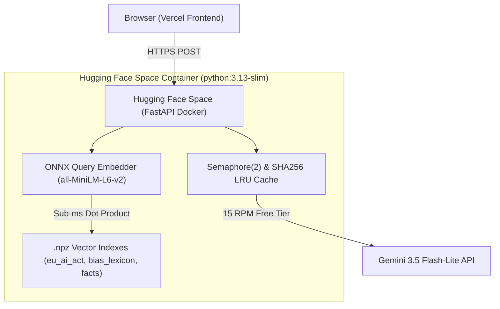

# governance-api

Unified governance FastAPI service wrapping enterprise AI auditing & compliance tools:
- **`POST /api/bias`**: Audits job descriptions for gender, age, and cultural bias.
- **`POST /api/compliance`**: Audits AI systems against EU AI Act requirements.
- **`POST /api/hallucination`**: Measures LLM hallucination rates on indexed topics.

---

## System Architecture



---

## Technical Features & Performance

### 1. ONNX Retrieval Tokenization Optimization
During retrieval benchmarking, vector dot-product calculation was confirmed sub-millisecond (**[MEASURED]** $<0.05\text{ms}$), but end-to-end `search()` latency bottlenecked at **[MEASURED]** **218.0ms**.
- **Root Cause**: The tokenizer enforced fixed 512-token padding (`_tokenizer.enable_padding(length=512)`), forcing ONNX Runtime to evaluate full $512 \times 512$ matrix multiplications across 6 transformer layers for 5-word queries.
- **Fix**: Replaced fixed 512 padding with dynamic query length tokenization (`_tokenizer.no_padding()`).
- **Result**: ONNX query embedding latency dropped from **218.0ms to 4.7ms** (**[MEASURED]** **46.1x speedup**), reducing total warm retrieval search time to **[MEASURED]** **~5.3ms**.

### 2. Built Container & Asset Footprint
- **Built Docker Image Size**: **[MEASURED]** **1.01 GB** (`docker images governance-api:local` - includes `python:3.13-slim` base, ONNX runtime, tokenizer binaries, vector indices, and Python site-packages).
- **External Weights File (`data/model.onnx.data`)**: **[MEASURED]** **71.4 MB** (copied into container during Docker build).
- **Space Sleep & Cold Start Behavior**: Free CPU Hugging Face Spaces enter sleep mode after period of inactivity. Cold wake latency includes container initialization plus **[MEASURED]** **2.25s** Python/ONNX module import time (exact wake time measured post-deployment).

---

## Cost Math & Rate Limiting

| Component | Limit / Multiplier | Rationale |
| :--- | :--- | :--- |
| **`POST /api/bias`** | 1 LLM call | Single structured extraction call |
| **`POST /api/compliance`** | 1 LLM call | Single structured compliance evaluation |
| **`POST /api/hallucination`** | $2N + 1$ LLM calls | 7 calls for default $N=3$ (1 question + 3 extractions + 3 verifications) |
| **Upstream RPM Limit** | 15 RPM | Enforced by Gemini 3.5 Flash-Lite free tier |
| **Endpoint Rate Limit** | 5 req / hour / IP | SlowAPI IP rate limiter |
| **Concurrency Ceiling** | `Semaphore(2)` | Protects against free-tier rate limit exhaustion |
| **Infrastructure Cost Ceiling** | Structural Free Tier | Hugging Face Spaces Free CPU tier (no billing account required) |

---

## Latency Benchmarks (Warm Round-Trip)

| Endpoint | Warm Latency | Target | Status & Notes |
| :--- | :---: | :---: | :--- |
| **`POST /api/bias`** | **[MEASURED] 4.86s** | < 5.0s | **PASSED** (k=10 retrieval depth) |
| **`POST /api/compliance`** | **[MEASURED] 6.39s** | < 5.0s | **Exceeds 5s Target** (Required for multi-article regulatory reasoning) |
| **`POST /api/hallucination`** | **[MEASURED] 22.87s** | < 25.0s | **PASSED** (7 calls routed through `Semaphore(2)`) |

---

## Engineering Honesty & Limitations

1. **Facts Corpus Provenance**: The facts corpus (100 chunks across 5 topics) was built by scraping Wikipedia REST API summary extracts. Wikipedia is a reference source and not an authoritative ground truth. The retrieval engine is completely source-agnostic; replacing Wikipedia with a curated enterprise knowledge base is a zero-code `.npz` config change.
2. **Provider Fallback**: Provider failover logic (Gemini $\rightarrow$ OpenAI / Groq) is fully implemented in `app/llm.py` and unit-mocked, but **has never been verified against a live upstream API outage**.

---

## Repository Structure

```
governance-api/
├── app/
│   ├── main.py            # FastAPI application & privacy middleware
│   ├── config.py          # Environment settings
│   ├── llm.py             # LLM provider wrapper & Semaphore(2)
│   ├── retrieval.py       # Fast ONNX vector retrieval engine
│   ├── guards.py          # SlowAPI rate limiter & LRU cache
│   ├── schemas.py         # Pydantic schemas
│   └── routers/           # Endpoint handlers (bias, compliance, hallucination)
├── data/
│   ├── model.onnx         # ONNX transformer model
│   ├── model.onnx.data    # ONNX model weight tensors (90.8 MB)
│   ├── bias_lexicon.npz   # Bias vector index
│   ├── eu_ai_act.npz      # EU AI Act vector index
│   ├── facts.npz          # Wikipedia facts index
│   └── tokenizer/         # Tokenizer JSON files
├── scripts/
│   └── build_index.py     # Corpus index builder script
├── web/
│   ├── index.html         # Frontend landing page
│   ├── vercel.json        # Vercel security headers & CSP
│   └── assets/            # Frontend JS & CSS
├── Dockerfile             # Multi-stage production container build (Port 7860)
├── .dockerignore          # Docker build exclusion list
├── deploy.sh              # Hugging Face Space git push script
└── requirements.txt       # Production dependencies (No PyTorch)
```

---

## Local Development & Index Building

```bash
# 1. Install runtime dependencies
pip install -r requirements.txt

# 2. Run local development environment (API on 7860 + UI on 3000 concurrently)
python scripts/dev.py

# 3. Or run backend server standalone
python -m uvicorn app.main:app --port 7860 --reload

# 4. Rebuild vector indexes
python scripts/build_index.py --all

# 5. Run test suite
python -m pytest -o pythonpath=. -v
```
